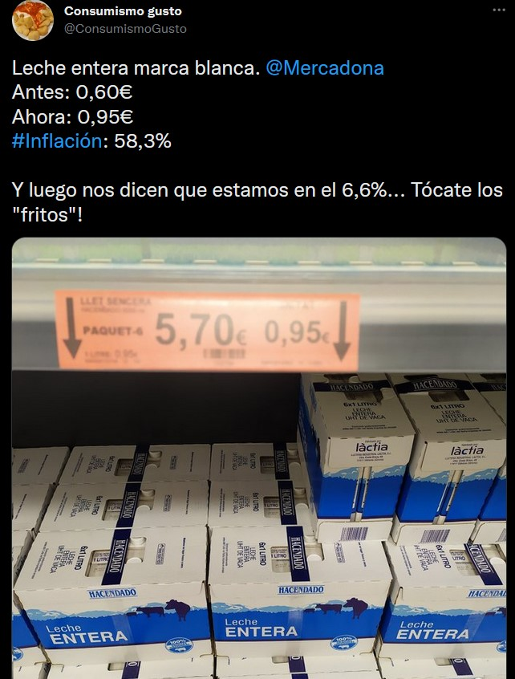
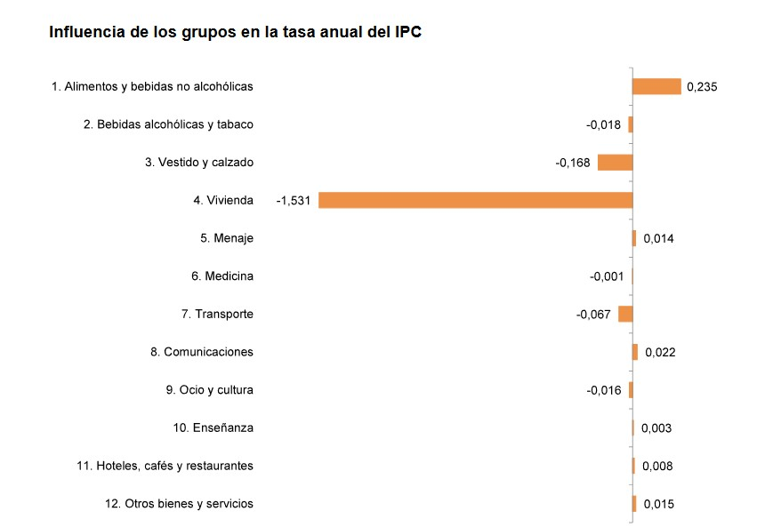

```{r echo = FALSE, include = FALSE, chunk-1}
library(ggplot2)
library(tidyverse)
library(skimr)
library(RMySQL)
library(plotly)
library(metafor)
library(dplyr)
library(DT)
```

```{r echo = FALSE}
library(knitr)
# Color text
colorize <- function(x, color) {
  
  if (knitr::is_latex_output()) {
    
    sprintf("\\textcolor{%s}{%s}", color, x)
    
  } else if (knitr::is_html_output()) {
    
    sprintf("<span style='color: %s;'>%s</span>", color, x)
    
  } else { x }
}
```

# 🙈 Contexto

Un domingo tranquilo por Twitter y me encontré con esta publicación

```{r contexto, echo = FALSE, fig.align = 'center',  include = identical(knitr:::pandoc_to(), 'html'), out.width = '70%'}

```

Este usuario de esta red social alertaba que, a pesar de que los medios y Gobierno hablaban de una inflación del 6,6% había productos, como la leche de Mercadona, que había subido un 58%. Aquí hay muchas cosas mal, así que tendremos que ir por partes para poder analizar debidamente qué es lo que está pasando.


# 📃 Los errores de este usuario

1️⃣ Dice que "antes" el precio era de 0,60€ pero no especifica cuándo es ese "antes"
    
* ¿Ayer?
* ¿La semana pasada?
* ¿El mes pasado?
* ¿El año pasado?
* ¿El mes de octubre del año pasado?
    
Esta información es importante dado que el dato es, según el INE es de un 6,8% a nivel general y del 6,3% la subyacente de noviembre con respecto a noviembre del año pasado. Además, de utilizar el dato de la subyacente, estaría metiendo algo que el indicador no incluye, pues <strong>la inflación subyacente no incluye en su cálculo a los alimentos no elaborados</strong>. No aporta el sistema referencial, por lo que ❌

2️⃣ Estamos ante un caso clarísimo de Paradoja Simpson. Ahora lo explicamos. 


3️⃣ Son datos no acordes con la realidad.


# 🤯  Estamos ante un caso clarísimo de Paradoja Simpson

Esta paradoja es muy común en estadística pues se trata cuando una tendencia que aparece en varios grupos de datos desaparece cuando estos grupos se combinan y en su lugar, aparece la tendencia contrario para los datos agregados. 

Su nombre se debe al artículo de E. Simpson en 1951 en el que explica que la media de las sumas no es igual a la suma de las medias.


Veamos un ejemplo.

> Tenemos en un año 1.000 accidentes de tráfico de los cuales 50 no llevaban cinturón y 950 sí. De los que <strong>no llevaban cinturón fallecieron 35 personas</strong> mientras que <strong>de los que lo llevaban, fallecieron 110</strong>. La conclusión parece obvia. <strong> El cinturón de seguridad no es eficaz</strong> ¡DGT QUIERO MI CARNET!

<details>

<summary>Vamos a verlo con más calma.</summary>

```{r echo=FALSE,warning=FALSE,out.width="110%", trafico}
knitr::opts_chunk$set(warning = FALSE, message = FALSE) 
paste0("El porcentaje de personas que fallecen sin cinturon es de 100*35/50, es decir: ",100*(35/50),"%") 
paste0("El porcentaje de personas que fallecen con cinturon es de 100*110/950, es decir: ",100*(110/950),"%") 
```
</details>

Parece que queda claro, hay quie ponerse el cinturón. Pues ahora vamos a hacer lo mismo, pero de forma visual.

```{r grafica-s1, echo = FALSE, fig.align = 'center',  include = identical(knitr:::pandoc_to(), 'html'), out.width = '70%'}
knitr::include_graphics('img/GraficoSimpson1.png')
```

Se ve claramente en el anterior gráfico que la tendencia es creciente ¿Verdad? Todo el mundo lo ve y nadie lo puede negar. Pero hagamos una cosa, pintemos los puntitos por grupos, vaya a ser que lo que aquí pase sea que los puntos de cada grupo estén muy juntos. Es decir, desagregemos.

<details>

<summary>¿Qué pasará? ¿Qué misterio habrá? Despliega haciendo click en la flecha, anda.</summary>

```{r echo=FALSE,warning=FALSE,out.width="110%", misterio}
knitr::include_graphics('img/cParadojaSimpson.png')
```

¡Vaya! Hay 5 grupos y cada uno decrece. Lo único que ocurre es que, al agrupar, la tendencia es creciente, pero por grupo se decrece.

Ahora se puede entender mejor por qué es tan común esta paradoja, de hecho, con las vacunas se vio. Había gente diciendo que la letalidad entre vacunados era mayor que entre no vacunados. Nuevamente la misma paradoja puesto que cuando desagregabas por edad, las personas menores de 50 años tenían una letalidad del 0% si estaban vacunados y algo mayor entre los mayores de 50 años vacunados. Pero ambas letalidades eran menores que en los no vacunados. Es decir, las vacunas estaban funcionando bien. 
</details>


Pues aquí pasa lo mismo.

# ⛔️ Son datos no acordes con la realidad

En la última nota de prensa del INE, se muestra cómo en marzo la inflación general era del 9,8% y ahora es del 6,8%. Es incuestinable que se ha reducido.

>⚠️ <strong>`r colorize("NOTA IMPORTANTE","#f3100c")`</strong>

>La reducción de la inflación no significa que los precios bajen, sino que la velocidad a la que crecen se ha ralentizado.

Esta nota es importante puesto que en comparación al mes anterior, los precios sí han bajado un 0,1%. Pero no solamente eso, si nos vamos a la nota de prensa de octubre (últimos datos completos disponibles), podremos ver la evolución de los precios por grupo.

```{r echo=FALSE,warning=FALSE,out.width="110%", grupos}

```

# 📝 Conclusiones

Hay un error de concepto en esa publicación. Si bien se entienden que, dado el contexto en España donde los salarios siguen la tendencia a la baja, lo que dificulta la obtención de bienes esenciales, la crítica realizada en esa publicación no es correcta. Como se comentó hace tiempo, este proceso inflacionario se debía al shock en la producción provocada por la pandemia, el cierre de empresas, los cuellos de botella en los puertos internacionales, la guerra en Ucrania y también por la pérdida de vidas humanas a causa del covid. Una vez que se fuese resolviendo esta situación, la situación se normalizará y los principales signos de llegar a la normalidad de precios ya se están dando.

El autor de la publicación cae, además del error de concepto y entendimiento de lo que es la inflación, en la paradoja Simpson. Al realizar el análisis por subgrupos, se encuentra que en muchos grupos los precios empiezan a bajar, la inflación general se ralentiza y, bien es cierto, que aún hay incrementos de precios en el sector de los alimentos, pero no del 58% como se menciona.

Se recuerda que la inflación es una subida generalizada de los precios en un periodo en concreto. Ese periodo no está detallado en la publicación.

No obstante, el objeto de esta Píldora no es el realizar un análisis del proceso inflacionario, sino de dar a conocer esta falacia aquí comentada para alertar al lector para que en futuras ocasiones, la tenga en cuenta y realice el análisis pertinente.

# Elaboración

Este documento ha sido realizado mediante `R` con [{rmarkdown}](https://github.com/rstudio/rmarkdown). Todo lo aquí comentado se compartirá todo el **código** de esta guía en mi [GitHub](https://github.com/manuelalen)


## Licencia {-}

[](https://www.gnu.org/licenses/gpl-3.0)

Este documento es publicado bajo **licencia pública general GNU**,
una licencia libre de copyleft que garantiza a los usuarios finales (personas, organizaciones, compañías) la **libertad de usar, estudiar, compartir (copiar) y modificar el software. Por cuestiones personales e idoelógicas, no es necesario citar el contenido de esta guía.** 


# ⛲️ Fuentes {-}

* [Nota de Prensa del INE sobre la Inflación en noviembre](https://www.ine.es/daco/daco42/daco421/ipcia1122.pdf)
* Simpson, E. H. (1951). The Interpretation of Interaction in Contingency Tables. Journal of the Royal Statistical Society. Series B (Methodological), 13(2), 238–241. http://www.jstor.org/stable/2984065.

* [Nota de Prensa del INE sobre la inflación en octubre](https://www.ine.es/daco/daco42/daco421/ipc1022.pdf)

